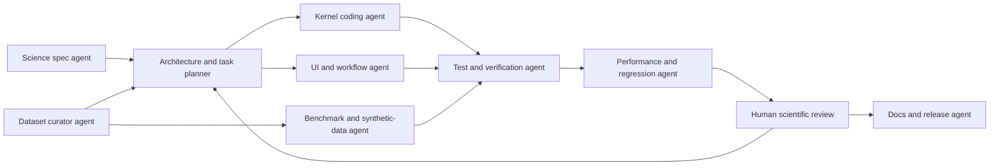
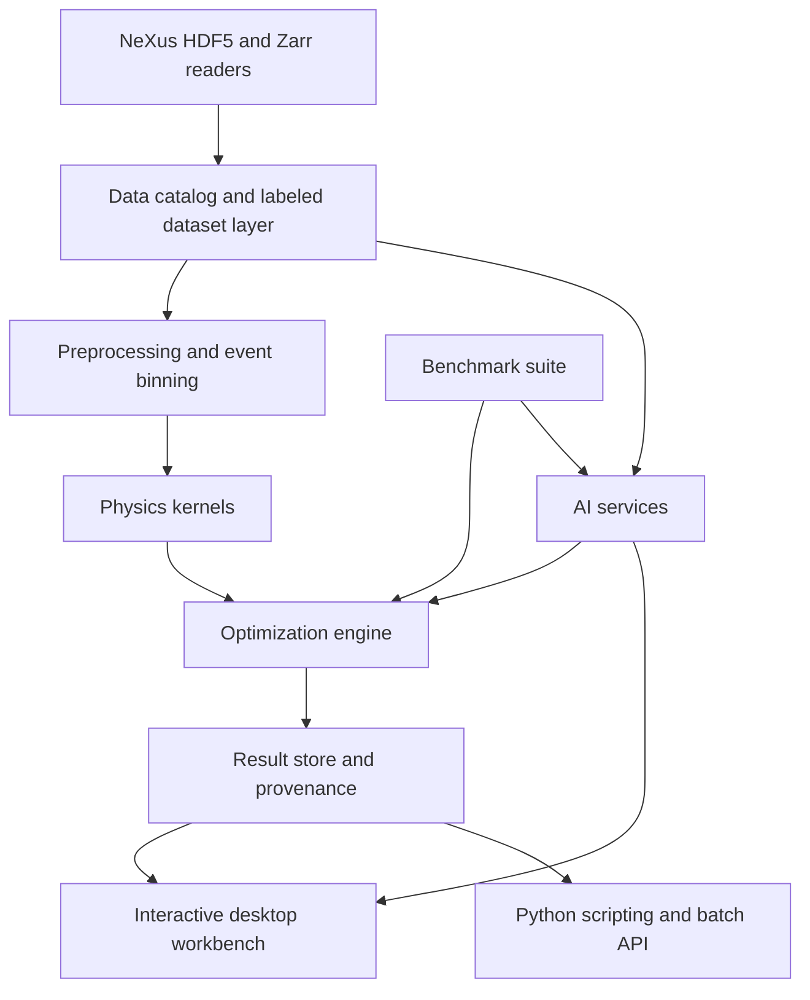

# Next-Generation Open-Source Rietveld Platform for Sequential and Parametric Diffraction

## Executive Summary

The clearest opportunity is **not** to build another single-file, monolithic least-squares Rietveld code. It is to build an **open, modular analysis platform** that treats sequential and parametric diffraction as first-class problems: ingesting large CW and TOF campaigns, preserving event-mode and multidimensional information where useful, coupling datasets through physically meaningful parameterizations, and exposing the full workflow through a modern interactive UX plus a scriptable API. Existing tools already provide much of the crystallographic depth: GSAS-II is the strongest broad open-source generalist for powder/single-crystal diffraction and sequential fitting, MAUD is exceptionally strong for combined analysis, texture, stress, and TOF workflows, FullProf remains foundational and highly capable, Mantid is the most mature open framework for neutron/event-data reduction and facility workflows, HEXRD is strong for high-energy X-ray image-based workflows, and DiffPy-CMI is the most explicitly modular open framework for multi-model co-refinement. But the ecosystem remains fragmented for **streaming/event data, robust cross-dataset parametric models, modern plugin architecture, transparent CI/benchmarking, and performance portability across CPU/GPU**. citeturn22view0turn22view1turn29search13turn22view2turn22view3turn39search2

The literature also points in the same direction. Parametric Rietveld refinement was introduced to fit ensembles of patterns with a **single evolving structural model**, reducing parameter correlation, enabling direct refinement of non-crystallographic quantities such as rate constants, and helping avoid false minima; subsequent applications showed its usefulness for order parameters, kinetics, and time-resolved studies. At the same time, sequential automation papers and official software updates repeatedly show that modern diffraction campaigns are now limited less by raw data acquisition than by **analysis burden, stability, and user effort**. Multibank TOF texture workflows, in particular, can be one to two orders of magnitude more computationally expensive than more fully integrated synchrotron workflows, and conventional focused 1D reductions can discard information that newer multidimensional fitting strategies can retain. citeturn24view0turn4search4turn4search8turn5search4turn19search3turn34view0turn24view3

The recommended technical direction is a **hybrid architecture**: Python as the control plane and public scripting layer; compiled C++ kernels exposed through pybind11 for profile evaluation, Jacobians, and instrument models; NeXus/HDF5 as the canonical archival format, with optional Zarr mirrors for chunked analysis; xarray as the labeled in-memory/model-facing data layer; Dask plus MPI for dataset-scale parallelism; an optional JAX backend for autodiff and accelerator execution; and a PySide6 desktop workbench for facility and lab users who need rich interactive sequential analysis rather than notebook-only workflows. This should be combined with an **agentic coding pipeline** in which specification, implementation, testing, benchmarking, and refactoring are separated into explicit roles and gated by executable tests, benchmark suites, and scientist review. The engineering stack for this approach is well aligned with official capabilities in JAX, MPI for Python, pybind11, Dask, xarray, HDF5 SWMR, GitHub Actions, pytest, Hypothesis, and ASV. citeturn13search4turn13search2turn13search3turn12search0turn12search1turn11search6turn14search0turn14search1turn14search2turn14search3

The roadmap below assumes open-ended constraints, but for concreteness it is written around a **three-year program** with a **CPU-first workstation/cluster baseline** and **optional GPU acceleration** for selected kernels and AI inference. A plausible staffing assumption is **6–8 core FTE-equivalent contributors** spanning crystallography, scientific software engineering, UX, performance engineering, and ML/AI. That assumption is not a fact from the sources; it is the scenario used for the milestone estimates in this report.

## Current Software Landscape

The current software landscape is best understood as a set of partially overlapping strengths rather than a single dominant solution. GSAS-II and MAUD are the broadest *open* scientific platforms for whole-pattern crystallographic analysis. FullProf remains central—especially for neutron and magnetic work—but its modernization is split between the classic Fortran engine, a renovated Python-based suite, and newer wrappers such as FullProfAPP. Mantid is indispensable for neutron/event-data workflows but is not, today, a full next-generation general powder-Rietveld environment. HEXRD is strong for high-energy X-ray image and diffraction geometry workflows, while DiffPy-CMI is strongest as a modular co-refinement framework rather than a turnkey Rietveld GUI. TOPAS remains an important benchmark because of its parametric and constraint machinery, but it is commercial/proprietary and therefore not a direct open-source base. citeturn22view0turn22view1turn23view5turn34view2turn22view2turn22view3turn39search2turn28search0

| Tool | Typical scope for your target problem | Language | License or status | Modularity and API | Parallelization and GPU posture | CI, testing, and visible activity | Sequential or parametric suitability | Evidence |
|---|---|---|---|---|---|---|---|---|
| **GSAS-II** | Broad crystallographic platform for X-ray and neutron diffraction; supports powder, CW, TOF, pink-beam, image integration, and large groups of datasets | Python with compiled components | BSD 3-Clause | Strong scripting surface via `GSASIIscriptable`; developer docs and application API are public | Handles large numbers of datasets; official docs reviewed are CPU-oriented and do not foreground GPU acceleration | Public GitHub repo with tests and Actions; docs built from Jun 2026 code; recent commits visible | **Strong** baseline for sequential refinement; parametric workflows possible but more script- and user-driven than first-class global modeling | citeturn22view0turn23view0turn37search13turn7search0turn17search2turn16search0 |
| **MAUD** | Combined diffraction/spectroscopy analysis; strong for texture, residual stress, microstructure, TOF, neutron, and multiphase analysis | Java | BSD-3-Clause in public repo | Broad scientific extensibility; batch analysis and recent plugin-like physics components are visible, but a polished public extension SDK is less explicit than Mantid or GSAS-II | Primarily CPU-facing in reviewed docs; no prominent GPU story in official materials reviewed | Public repo and release notes; latest visible release Aug 2025; active tutorial ecosystem | **Strong**, especially for texture/stress and multibank TOF; automation often improved through wrappers such as MILK | citeturn22view1turn3search5turn9search9turn9search3turn31search4turn34view0 |
| **FullProf Suite** | Foundational Rietveld package for neutron CW/TOF, X-ray, and magnetic structures | Fortran core; renovated Python/PySide6 GUI under development | Core engine is openly downloadable, but the current official docs reviewed do **not** clearly advertise an OSI license for the core suite | Historically less modular from a modern API standpoint; major renovation is underway, including a rewritten main program and new GUI | No prominent GPU story in reviewed official docs | Official docs state full renovation is underway; downloads dated Apr–May 2026 are available | **Strong scientific engine**, especially for neutron and magnetic refinement; less attractive than a new codebase as the sole modern open platform substrate | citeturn23view5turn23view6turn29search13turn18search9 |
| **FullProfAPP** | Automation and visualization layer for large pattern collections, high-throughput screening, and in situ or operando sequential refinement | Python, wrapping FullProf | AGPL-3.0 | Explicit user-defined workflow layer; open-source wrapper around FullProf | No documented GPU positioning in reviewed materials | Recent docs and 2024 paper; active deployment around FullProf workflows | **Useful model** for automation and UX, but it depends on FullProf and inherits engine constraints | citeturn34view2turn35view0turn30search1turn30search16turn23view6 |
| **Mantid** | Open framework for neutron and muon data reduction, visualization, event workspaces, focusing, and engineering diffraction interfaces | C++ with Python API | GPL-3.0 | Strong plugin architecture; Python or C++ algorithms can be added | HPC-oriented framework; reviewed docs emphasize workspaces, algorithms, and facility workflows rather than GPU Rietveld kernels | Nightly releases and active repo/build infrastructure are visible | **Important complement**, especially for event-mode TOF and reduction; not yet the full turnkey powder-Rietveld destination for your use case | citeturn22view2turn23view1turn36search0turn36search1turn17search12turn17search0 |
| **HEXRD** | Open X-ray diffraction toolkit for powder, Laue, and HEDM/3DXRD; strong detector/instrument abstractions | Python | BSD 3-Clause | Public API and developer guide | Parallel image-analysis improvements are visible; official docs reviewed do not present a GPU-first powder-Rietveld path | Current docs/version visible in Jun 2026; active repo organization | **Adjacency value is high**, especially for high-energy X-ray geometry/image workflows, but it is not the obvious core for neutron CW/TOF + general Rietveld + parametric campaigns | citeturn22view3turn23view2turn17search5turn17search9 |
| **DiffPy-CMI** | Modular complex-modeling framework for co-refinement and multi-modal optimization rather than a turnkey Rietveld GUI | Python with C++ components | BSD-3-Clause | Very strong modularity: packs, profiles, custom workflows, and external calculators | Primarily CPU-focused in reviewed docs | Docs updated Dec 2025; community and releases visible | **Excellent conceptual template** for global, coupled, physically parameterized refinement, but not a ready-made powder Rietveld application | citeturn39search2turn39search7turn39search8turn19search6turn22view4 |
| **TOPAS** | Very capable nonlinear least-squares engine for multi-dataset Bragg/PDF refinement and advanced constraints | C++ | Proprietary commercial product; academic variant exists but is not an open-source base | Strong macro language and constraint machinery | Not an open-source GPU baseline | Active commercial product and current academic materials visible | **Reference benchmark**, not an open-source foundation | citeturn28search0turn28search8turn28search4 |

A key strategic observation is that **GPU acceleration is not the visible differentiator** in the official documentation reviewed for the major open scientific packages above. That is a genuine opening for a new platform, provided the GPU path is optional and does not compromise numerical transparency or reproducibility. citeturn22view0turn3search5turn23view5turn22view2turn23view2

## Literature Review and Bottlenecks

The conceptual foundation for the proposed program remains the **parametric Rietveld** idea introduced by Stinton and Evans: instead of refining each pattern independently, an ensemble of diffraction datasets can be fitted to a **single evolving structural model**. Their original argument is still decisive for dynamic-stimuli work: parametric refinement can increase precision, impose physically realistic constraints, directly refine non-crystallographic quantities such as temperatures or rate constants, and reduce the chance of false minima. The International Tables treatment reinforces that this approach can drastically reduce the number of global parameters when the dependence of structural variables on an external stimulus is modeled explicitly rather than rediscovered dataset by dataset. Follow-on studies demonstrated direct refinement of order parameters and kinetic quantities from powder data in realistic applications. citeturn24view0turn4search4turn4search8turn5search4

For your target problem—dynamic strain, texture, phase evolution, and atomic motion under changing stimuli—the literature also shows that **data representation itself is a bottleneck**. Traditional workflows often pre-reduce data into focused 1D profiles because that makes classical Rietveld engines tractable, but that convenience can cost information. The 2015 two-dimensional TOF Rietveld paper is especially important here: it argues that fitting in both scattering angle and wavelength can avoid common data-reduction losses and better adapt to varying resolution functions, demonstrating the comparative value of retaining multidimensional structure in TOF analysis. On the X-ray side, Rietveld refinement on laboratory EDXD data was shown to be feasible even with lower resolution, but that same paper underscores why EDD requires careful profile and background treatment. Earlier time-resolved work also noted the tradeoff that EDD is naturally well suited for time-resolved studies, while monochromatic workflows can provide better d-space resolution in multiphase cases. citeturn24view3turn5search3turn5search12

Automation papers are equally revealing because they expose where current systems fail in practice. **SrRietveld** was designed explicitly to automate large batches of refinements and to improve user experience, because conventional packages often diverge and require substantial intervention. **MILK** showed how a Python interface layered on top of MAUD can organize multibank neutron texture data, generate metadata tables, validate starting states, and execute a refinement sequence that has proven robust in many cases—yet the paper is explicit that low-volume-fraction phases, many phases, or severe peak overlap still break robustness. **FullProfAPP** demonstrates the same need from another angle: the growth of high-throughput, in situ, and operando diffraction is forcing the community to build new workflow layers above older refinement engines, largely to manage refinement order, background handling, batch orchestration, and visualization. citeturn19search3turn34view0turn34view2

The stability literature remains brutally relevant. The IUCr Rietveld refinement guidelines emphasize that refinement quality depends on every stage from data collection to model setup, and they catalog practical pitfalls rather than promising algorithmic magic. Toby’s discussion of R factors is equally important, because it warns against over-reading single scalar fit metrics as proof of physical correctness. In other words, robust next-generation software must do more than optimize χ²: it must expose **parameter correlations, conditioning, trajectory diagnostics, uncertainty quality, failure states, and model inadequacy** in a way that is visible to users during refinement, not only after publication. citeturn10search3turn10search4turn10search0

Recent AI-oriented papers should be read with caution but not ignored. PQ-Net demonstrated that neural networks can estimate quantitative diffraction parameters quickly enough to matter for real-time analysis. BBO-Rietveld framed refinement as black-box optimization, and the 2026 RAPID paper argues that ML-based initialization can automate much of the manual setup burden and reach R factors comparable to conventional refinement on its test cases. But that same 2026 paper also notes that genuinely automated crystal-structure determination by Rietveld remains relatively uncommon, and most work still focuses on classification or initialization rather than full scientific judgment. The lesson for a new platform is therefore clear: **AI should initialize, prioritize, diagnose, and recommend**, while physically constrained refinement and human validation remain the scientific core. citeturn6search1turn6search9turn24view4

## Technical Requirements

A serious platform for parametric diffraction must treat data as a **labeled, hierarchical, and partially streaming object**, not just as a folder of independent XY files. NeXus already provides the correct facility-facing foundation: it is an international standard for neutron, X-ray, and muon science; it defines application structures relevant to monochromatic powder and TOF diffraction; and it includes `NXevent_data` for event-mode neutron detector streams. HDF5 chunking and SWMR make it practical to read large files efficiently and even read from a file while it is being written, while Zarr offers an open standard for chunked compressed N-dimensional arrays. On the analysis side, xarray and Dask provide exactly the semantics needed for labeled multidimensional campaigns with lazy, chunk-aware parallel execution. The practical implication is that the new program should adopt **NeXus/HDF5 as archival truth**, offer **Zarr mirrors or exports for chunked analytics**, and expose **xarray datasets** internally for refinement orchestration. citeturn16search11turn11search1turn11search0turn11search2turn11search6turn11search15turn12search1turn12search0

At the model level, the program must natively distinguish **local**, **shared**, **global**, and **functional** parameters. That means one should be able to say, for example, that zero shift is shared within an instrument block, scale factors are local to datasets, texture coefficients are coupled across banks of the same sample state, lattice parameters follow a function of temperature or stress, and ADPs can be prescribed or learned across a stimulus series. Existing open tools demonstrate pieces of this: GSAS-II handles large groups of datasets and sequential fitting; DiffPy-CMI is explicitly built for co-refinement from multiple models and information sources; and the parametric-refinement literature shows why physically meaningful parameter functions are superior to blind per-pattern refits for stimulus-response studies. citeturn22view0turn22view4turn24view0turn4search4

For optimization, the program should not rely on a single nonlinear least-squares mode. The optimization layer should expose at least three distinct paths: a **bounded trust-region least-squares** path for robust routine refinement; a traditional **Levenberg–Marquardt** path for small, well-conditioned local problems; and a **multi-start or global-search-assisted initialization** path for hard phase-appearance, overlap, and background scenarios. Official SciPy documentation is clear that trust-region reflective methods are well suited to large sparse problems with bounds, while dogbox is weaker for rank-deficient Jacobians. In practice, a next-generation platform should leverage that logic and then go further by surfacing parameter-rank warnings, covariance singularity alerts, Jacobian condition indicators, and residual diagnostics by region, bank, phase, and time. The literature on Rietveld guidelines and fit factors makes that visibility essential. citeturn10search2turn10search1turn10search3turn10search0

Performance requirements should be defined in two layers. First, there is **intra-pattern performance**: fast profile evaluation, structure-factor updates, sparse Jacobian assembly, and constrained solves. Second, there is **campaign performance**: orchestration over hundreds to tens of thousands of datasets, banks, and stimulus states. Dask and MPI for Python are natural choices for the second layer, while compiled kernels plus optional JAX acceleration are the most coherent route for the first. JAX’s official documentation is explicit about automatic differentiation and XLA compilation across GPUs and other accelerators, while pybind11 remains the cleanest low-friction bridge for exposing compiled C++ kernels into Python. My recommendation is therefore **CPU-first compiled kernels**, with **autodiff/GPU support as an optional backend** for selected operations such as profile gradients, differentiable instrument functions, and AI inference—not as a mandatory dependency for correctness. citeturn12search0turn13search2turn13search4turn13search3

Finally, reproducibility cannot be an afterthought. Every refinement artifact should be traceable to a dataset digest, instrument model version, phase-definition set, parameter graph, optimizer configuration, seed, environment lock, and prior initialization source. Existing open crystallographic software has powerful scientific functionality, but benchmark reproducibility and software quality signals vary widely across projects; a new platform should therefore make reproducibility part of the product model rather than a separate “developer mode.” This is one place where the new project can surpass the current field without superseding anyone’s scientific legacy. citeturn7search0turn32view2turn14search0turn14search3

## Agentic Development Pipeline

An agentic coding strategy is worthwhile here because the problem is both **scientifically deep** and **software-system large**. Benchmarks such as SWE-bench emphasize that realistic software engineering tasks require reasoning over an actual codebase, issue specification, patch generation, and executable validation, while OpenHands and related agent platforms stress the need for sandboxed environments, benchmark harnesses, and multi-agent coordination. For this domain, that means agents should **never** refine the science autonomously from raw language prompts alone; instead, they should work against explicit specifications, typed schemas, benchmark datasets, and executable regression tests. citeturn21search0turn21search7

The pipeline should be organized around explicit roles rather than a single “coder agent.” That keeps domain judgment separate from code generation and prevents a false sense of scientific automation.

| Agent or role | Primary responsibility | Required artifacts | Human gate |
|---|---|---|---|
| **Science specification agent** | Convert scientific goals into typed requirements, acceptance tests, and parameter schemas | problem statement, modality matrix, benchmark IDs, failure criteria | Required for every major feature |
| **Architecture planner** | Break requirements into components, interfaces, and milestones | API contracts, ADRs, task graph | Required for optimizer, file I/O, and UX changes |
| **Kernel coding agent** | Implement C++/Python computational kernels and bindings | patch, unit tests, numerical reference checks | Required for math-heavy changes |
| **Workflow/UI agent** | Build scripting workflows, job orchestration, and interactive views | UI tests, state diagrams, usability notes | Required for user-facing flows |
| **Dataset curator agent** | Version real datasets and produce benchmark manifests | checksums, metadata, licensing, splits | Required before benchmarks enter CI |
| **Synthetic-data agent** | Generate physics-based synthetic campaigns with known truth | generators, seed control, expected distributions | Required for each modality family |
| **Verification agent** | Run unit, property-based, regression, and scientific oracles | pytest, Hypothesis, golden files | Blocking gate |
| **Performance agent** | Track runtime, memory, scaling, and regression trends | ASV results, profiler artifacts | Blocking gate for core kernels |
| **Release/docs agent** | Produce changelogs, docs, migration notes, benchmarks dashboard | docs, example notebooks, release bundle | Final gate |

The CI/CD side should be conventional and uncompromising. GitHub Actions is an appropriate orchestration layer for matrix builds, benchmark jobs, and artifact publishing; pytest provides scalable fixtures; Hypothesis is the right tool for edge-case and property testing; and ASV is designed to track runtime and memory across project history. This stack is mature, open, and already aligns with the surrounding scientific Python ecosystem. citeturn14search0turn14search1turn14search2turn14search3

The most important human-in-the-loop checkpoints should be placed at **five boundaries**: new file readers and metadata semantics; changes to profile or instrument models; changes to uncertainty propagation; AI-driven parameter initialization logic; and any patch that alters public scientific defaults. In this domain, “it passes tests” is not enough if the tests do not encode crystallographic reality.

## Architecture Blueprint

The architecture should be organized around a stable separation between **data**, **physics**, **optimization**, **interaction**, and **governance**. Existing projects strongly suggest the right primitives: NeXus/HDF5 for facility truth and event-mode representation, xarray for labeled multidimensional data, Dask and MPI for scale-out, pybind11 for compiled kernels behind a Python API, JAX for optional autodiff/accelerators, and PySide6 for a modern desktop experience. That combination gives both facility-scale and laptop-scale users a coherent model. citeturn11search0turn11search1turn11search6turn12search1turn12search0turn13search2turn13search3turn13search4turn30search5

| Component | Recommended implementation | Why it fits the evidence base |
|---|---|---|
| **Data ingestion** | NeXus/HDF5 readers for archival truth; optional Zarr mirrors for chunked analytics | NeXus already covers powder and event-mode diffraction, HDF5 supports chunking and SWMR, and Zarr is a natural chunked-array complement. citeturn11search0turn11search1turn11search2turn11search6turn11search15 |
| **Core in-memory model** | xarray `Dataset` with dimensions such as dataset, bank, channel, time, temperature, stress, and azimuth | xarray is designed for labeled N-dimensional scientific data and reduces indexing ambiguity in stimulus-series workflows. citeturn12search1 |
| **Campaign execution** | Dask for blocked/lazy array orchestration; MPI for cluster execution where appropriate | Dask supports blocked algorithms on arrays larger than memory; MPI for Python is the standard bridge to clusters and supercomputers. citeturn12search0turn13search2 |
| **Physics kernels** | C++ kernels for peak shapes, structure factors, instrument models, Jacobians, and constraints, exposed through pybind11 | Preserves performance and numerical control while keeping Python as the public interface. citeturn13search3 |
| **Optimization stack** | Bounded least squares as default, LM for local fits, multi-start helpers, sparse Jacobians, optional differentiable backend | The official least-squares guidance favors trust-region reflective methods for large bounded problems, while the literature shows why false minima and rank issues matter. citeturn10search2turn24view0turn10search3 |
| **Accelerator backend** | Optional JAX implementation for selected kernels and autodiff | JAX provides autodiff and XLA compilation across accelerators without forcing the whole product into a DL framework. citeturn13search0turn13search4 |
| **Interactive UX** | PySide6 desktop workbench with linked plots, parameter trajectories, residual heat maps, and phase-state dashboards | PySide6 is the official Qt-for-Python path and matches the trend visible in modernized diffraction tool UIs. citeturn30search5turn23view5 |
| **AI modules** | Separate services for initialization, anomaly detection, model suggestion, automatic constraints, and active-learning triage | Recent work supports AI for parameter estimation and workflow automation, but not for replacing physically constrained refinement. citeturn6search1turn24view4 |
| **Provenance and catalog** | Embedded metadata index plus immutable refinement manifests and artifact store | Needed to make sequential/global science reproducible and benchmarkable across facility and lab contexts. Supported by the reproducibility lessons from modern CI and benchmark tooling. citeturn14search0turn14search3 |

On UX, the platform should center the **stimulus trajectory**, not the single pattern. The primary screen should therefore be an “experiment state map” with synchronized views of stimulus coordinates, residual heat maps, phase fractions, lattice metrics, texture metrics, and outlier flags. Clicking any anomaly should reveal the underlying pattern, fit, parameter trajectory, and provenance. That interaction model directly addresses the workflow pain that FullProfAPP, MILK, and GSAS-II sequential tutorials are trying to manage through wrappers, scripts, or results tables rather than a unified dynamic-analysis workspace. citeturn34view2turn35view1turn16search0

The plugin API should be explicit and versioned from the beginning. At minimum, third parties should be able to register **file readers, instrument kernels, profile/background models, scattering calculators, constraints/restraints, optimizers, AI recommenders, exporters, and visualization panels**. Stability of those interfaces will matter more to the long-term health of the project than any specific optimizer choice.

## Testing, Validation, and Benchmarks

The testing plan should combine **software correctness**, **scientific fidelity**, and **operational robustness**. At the software layer, unit tests should cover parameter graphs, file parsers, instrument models, and optimizer kernels. Property-based tests should probe pathological edge cases such as degenerate parameter couplings, bad bounds, empty histograms, NaN backgrounds, and malformed metadata. Integration tests should run end-to-end mini-refinements across each supported modality. Regression tests should pin both numerical outputs and user-facing artifacts such as exported reports or serialized projects. Performance tests should track runtime and memory trends over time. The standard open stack for this is GitHub Actions, pytest, Hypothesis, and ASV. citeturn14search0turn14search1turn14search2turn14search3

The benchmark suite should be organized into three tiers. A **gold real-data tier** should include trusted public examples that reflect real scientific pain points: the GSAS-II CuCr\(_2\)O\(_4\) temperature-sequence tutorial for basic sequential refinement; the NIST MAUD tutorial files for neutron diffraction texture and dual-phase analysis; and Mantid engineering-diffraction/event-workspace examples for neutron reduction and sequential fitting contexts. A **silver real-data tier** should include harder public or partner datasets with incomplete truth but known scientific expectations. A **bronze synthetic tier** should contain large, procedurally generated campaigns spanning phase appearance/disappearance, texture evolution, lattice strain, mixed backgrounds, detector dropout, metadata corruption, and deliberate false-minimum traps. The sources already show that both GSAS-II and MAUD can support physics-based simulation workflows, and MAUD has even added routines for AI-training simulation. citeturn16search0turn16search1turn36search0turn36search1turn15search1turn15search8

Synthetic benchmarks should not merely randomize parameters. They should be *scientifically structured* around known failure modes from the literature: weak phases and strong overlap, which MILK identifies as breaking robustness; low-resolution EDD cases; multidimensional TOF cases where focusing loses information; and parameter-correlation scenarios highlighted by parametric-refinement and Rietveld-guideline papers. If the synthetic generator cannot produce these hard cases on demand, the benchmark suite will not protect the software from the failures that matter most in dynamic-stimuli experiments. citeturn34view0turn5search3turn24view3turn24view0turn10search3

The recommended validation metrics are broader than conventional R factors. The project should track convergence success rate, false-minimum rate, parameter bias on synthetic truth, calibration of standard uncertainties, robustness to perturbed initial guesses, runtime per pattern and per campaign, memory per active dataset, scaling efficiency across cores or nodes, and user-time-to-answer for common tasks such as “find the phase-transition onset” or “locate the first texture anomaly.” Toby’s warning about overinterpreting R factors should be hard-coded into the philosophy of the benchmark dashboard. citeturn10search0turn10search4

## Roadmap and Sustainability

The roadmap below is written for a three-year program under the working assumption of **6–8 core FTE-equivalent contributors** plus beamline and domain-science partners. The effort estimates are planning assumptions, not facts from the cited sources.

| Milestone | Indicative window | Main objectives | Exit criteria | Main risks |
|---|---|---|---|---|
| **Foundation and benchmark harness** | Months 0–6 | Freeze scope, define data schemas, assemble benchmark suite, stand up CI/CD, implement minimal project format and data catalog | Public repo, reproducible CI, benchmark manifest, first NeXus/HDF5 readers, first scripted refinement smoke tests | Underestimating I/O and metadata complexity |
| **Core engine alpha** | Months 6–12 | Implement parameter graph, constraints/restraints, C++ kernels, Python bindings, bounded least-squares path, project serialization | Alpha solves single-pattern CW and basic TOF cases with regression coverage | Numerical instability, over-engineered abstractions |
| **Sequential and global beta** | Months 12–18 | Native sequential refinement objects, shared/global/functional parameters, trajectory diagnostics, residual heat maps, uncertainty dashboard | Benchmark success on GSAS-II sequential case and representative multiphase benchmarks | Cross-dataset conditioning and difficult uncertainty math |
| **Texture, strain, and multidimensional support** | Months 18–24 | Add azimuthal/texture-aware models, stress and lattice-strain workflows, multibank support, optional 2D/angle–wavelength pathways | Strong results on MAUD-like texture benchmarks and selected multibank TOF cases | Scope creep, complexity explosion in UX |
| **AI-assisted analysis and streaming mode** | Months 24–30 | Add initialization models, anomaly detection, constraint recommendation, active-learning queue, streaming/event-aware preview updates | AI improves time-to-first-fit without degrading validated science workflows | User over-trust, model drift, opaque recommendations |
| **Facility-grade release** | Months 30–36 | Documentation, plugin SDK, governance, long-term benchmark dashboard, release engineering, community onboarding | Stable 1.0 release with public docs, benchmark reports, and extension API | Maintenance burden and funding cliff |

The sustainability model should be community-first and institution-aware. The package should be governed by a small technical steering committee with representation from at least one synchrotron-style workflow, one neutron TOF/event-data workflow, one texture/stress user group, and one software-engineering lead. An RFC process for scientific defaults, instrument models, and plugin APIs will matter. So will a publicly visible benchmark dashboard. The ecosystem evidence is simple: the most durable scientific tools are the ones with documentation, public APIs, and community workflows—not just sophisticated mathematics. citeturn23view0turn23view1turn34view2turn14search0

A realistic funding and maintenance strategy would mix **research funding for new methods** with **infrastructure funding for stability and community support**. The strongest partnership targets are the institutions already visible in the current ecosystem: APS/ANL around GSAS-II, ILL around FullProf, Trento and neutron-texture groups around MAUD, ORNL/ISIS/SNS-style workflows around Mantid, and diffpy contributors for modular co-refinement ideas. This does not mean forking those projects politically or technically; it means designing a platform that can interoperate with them and learn from their strongest ideas. citeturn22view0turn23view5turn22view1turn22view2turn39search2

**Open questions and limitations.** The main incompleteness in the source base is the current licensing and long-term modernization status of the **core FullProf engine**, which is openly downloadable and actively renovated but not as clearly documented under a modern OSI-style license in the official materials reviewed here as GSAS-II, MAUD, Mantid, HEXRD, DiffPy-CMI, or FullProfAPP. A second limitation is that some original historical papers remain easier to access through secondary mirrors than through current primary hosting, so this report has prioritized official project sites and official/open literature where available and been explicit when a status judgment was inferred from those materials rather than directly stated. citeturn23view5turn23view6turn22view0turn22view1turn22view2turn22view3turn39search8turn30search1